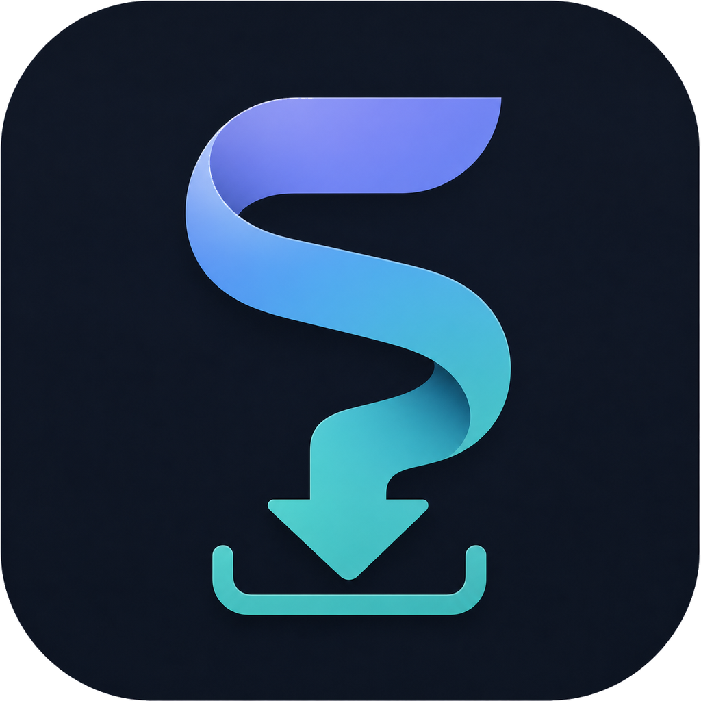

<!-- codex-branding:start -->
<p align="center"></p>

<p align="center">
  
  
  
</p>
<!-- codex-branding:end -->

# StreamKeep

A multi-platform desktop GUI tool for downloading VODs and live streams with native extractors, channel monitoring, segmented downloads, GPU-accelerated post-processing, and a built-in media converter.


## Supported Platforms

| Platform | VOD Listing | Live Download | Method |
|----------|:-----------:|:-------------:|--------|
| **Kick** | Yes | Yes | Native API (`/api/v2/channels`) |
| **Twitch** | Yes | Yes | Native GraphQL + Usher m3u8 |
| **Rumble** | - | Yes | Native Embed API (HLS + MP4) |
| **SoundCloud** | - | - | Native API v2 (progressive + HLS) |
| **Reddit** | - | - | Native JSON API (DASH + fallback MP4) |
| **Audius** | - | - | Native Discovery API (direct stream) |
| **Podcast RSS** | Yes (episodes) | - | RSS feed parser (enclosure URLs) |
| **Direct URLs** | - | - | Content-Type sniffing (mp4, mp3, m3u8, etc.) |
| **YouTube, Facebook, 1000+ sites** | - | Varies | yt-dlp fallback |

## Features

### Download
- **Multi-platform** — native extractors for Kick, Twitch, Rumble, SoundCloud, Reddit, Audius, Podcast RSS + yt-dlp fallback
- **Auto-detect** — paste any URL, StreamKeep identifies the platform and resolves the stream
- **Platform badge** — colored label shows which extractor matched your URL
- **VOD browser** — list all VODs for a channel, check the ones you want, batch download
- **Quality picker** — choose from all available qualities (1080p, 720p, 480p, etc.)
- **Configurable segments** — split downloads into 15min, 30min, 1hr, 2hr, 4hr chunks, or full stream
- **HLS + MP4 + audio** — supports HLS streams, direct MP4, and audio downloads (mp3, m4a, etc.)
- **Direct URL detection** — paste any raw media URL (mp4, mp3, m3u8) and it auto-detects via Content-Type
- **Multi-connection parallel download** — direct MP4 URLs are split across N HTTP Range requests (default 4, max 16) for 3-5x speedup on CDN-hosted content
- **Podcast RSS** — paste an RSS feed URL to list and download all episodes
- **Clipboard Watch** — toggle clipboard monitoring to auto-load URLs as you copy them
- **Resume-friendly** — skips already-downloaded segments on re-run
- **Speed/ETA tracking** — real-time download speed, ETA, and file size in progress bars
- **Metadata saving** — writes `metadata.json` + thumbnail alongside every download

### Media Converter
- **Video formats** — mp4, mkv, webm, mov, avi, ts, flv
- **Video codecs** — copy (remux), h264, h265, vp9, av1, mpeg4
- **GPU encoders** — NVENC (NVIDIA), Quick Sync (Intel), AMF (AMD), VideoToolbox (Apple) — auto-detected at startup via a parallel 1-frame probe, 5-20x faster than software encoders
- **Resize** — downscale to 2160p / 1440p / 1080p / 720p / 480p / 360p (aspect ratio preserved)
- **FPS cap** — limit output to 60 / 30 / 24 fps
- **Audio formats** — mp3, m4a, ogg, opus, flac, wav, aac
- **Audio codecs** — copy, mp3, aac, opus, vorbis, flac, pcm + bitrate (96k-320k) and sample rate (48000 / 44100 / 22050)
- **Auto post-process** — converter runs on every fresh download when enabled
- **Standalone mode** — **Convert Files...** / **Convert Folder...** buttons apply the current settings to any existing file or folder (recursive), with progress + cancel

### Channel Monitor
- **Watch channels** — add Kick or Twitch channels to monitor for live status
- **Auto-record** — automatically start recording when a monitored channel goes live
- **Configurable polling** — per-channel interval (30-600 seconds)
- **Round-robin** — checks one channel per tick to avoid API hammering

### History & Settings
- **Download history** — persistent log of all completed downloads, double-click to open folder
- **Config persistence** — UI/preferences live in `%APPDATA%\StreamKeep\config.json`, while history, monitor channels, and queue are stored in `%APPDATA%\StreamKeep\library.db`
- **Settings tab** — shows ffmpeg/yt-dlp versions, configure default output directory

## Requirements

- **Python 3.10+**
- **ffmpeg** in PATH
- **PyQt6** (auto-installed on first run)
- **yt-dlp** (auto-installed, optional — needed for non-native platforms)

## Usage

```bash
pip install -r requirements.txt
```

```bash
python StreamKeep.py
```

## Validation

```bash
python -m unittest discover -s tests -p "test_*.py"
```

### Quick Start

1. Paste a URL:
   - `kick.com/fishtank` — lists all Kick VODs
   - `twitch.tv/xqc` — lists Twitch VODs or records live
   - `rumble.com/v...` — downloads Rumble video
   - `soundcloud.com/artist/track` — downloads SoundCloud audio
   - `reddit.com/r/.../comments/...` — downloads Reddit video
   - `audius.co/artist/track` — downloads Audius audio
   - RSS feed URL — lists podcast episodes
   - Any `.mp4`, `.mp3`, `.m3u8` URL — direct download
   - Any other video URL — falls back to yt-dlp
2. Click **Fetch**
3. Select quality and segment length
4. Click **Download Selected** or **Download All Checked** for batch

### Channel Monitoring

1. Switch to the **Monitor** tab
2. Paste a channel URL and set poll interval
3. Check **Auto-Record** to automatically capture when the channel goes live
4. StreamKeep checks channels in round-robin and starts recording automatically

### Media Conversion

1. Open the **Settings** tab and scroll to **Post-Processing**
2. Tick **Convert video to:** or **Convert audio to:** and pick a container, codec, and optional scale/FPS/bitrate
3. Either:
   - Click **Save Settings** — every future download is auto-converted
   - Click **Convert Files...** to pick files directly, or **Convert Folder...** to recursively convert an entire directory
4. GPU encoders (NVENC, QSV, AMF, VideoToolbox) appear in the codec dropdown automatically when a compatible GPU is detected

## Architecture

StreamKeep uses a plugin-style extractor system with `__init_subclass__` auto-registration. Each platform is a self-contained class. Native extractors provide VOD listing, live detection, and direct API access. The yt-dlp fallback catches any URL not handled by native extractors.

```
URL Input
  -> Extractor.detect(url)  — matches URL against registered patterns
    -> Native Extractor (Kick, Twitch, Rumble, SoundCloud, Reddit, Audius, RSS)
    -> Direct URL Detector (HEAD + Content-Type sniffing)
    -> YtDlpExtractor fallback (everything else)
  -> StreamInfo (qualities, duration, metadata)
  -> DownloadWorker (ffmpeg -c copy, segmented, optional parallel HTTP Range)
  -> PostProcessor (optional convert / loudnorm / chapter split / contact sheet)
  -> metadata.json + history entry
```
