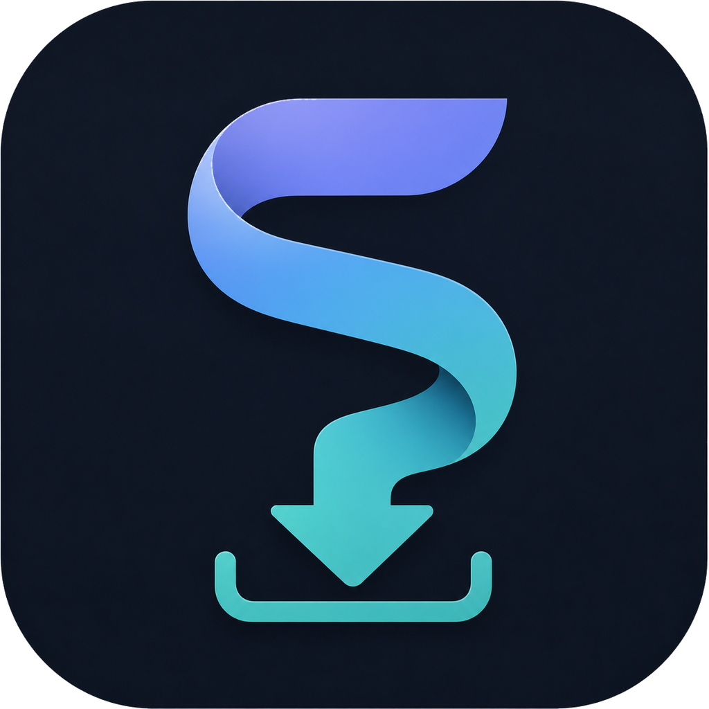

<p align="center">
  
</p>

# StreamKeep


StreamKeep is a local-first desktop downloader and archive manager for live streams, VODs, podcasts, and direct media URLs. It combines native extractors, yt-dlp fallback, channel monitoring, queue management, post-processing, an embedded player, and a CLI/server mode in one PyQt6 application.


## Supported Sources

| Source | VOD listing | Live capture | Method |
| --- | :---: | :---: | --- |
| Kick | Yes | Yes | Hybrid official + v2 API |
| Twitch | Yes | Yes | Native GraphQL + Usher HLS |
| Rumble | No | Yes | Native embed API |
| SoundCloud | No | No | Native API v2, progressive and HLS |
| Reddit | No | No | JSON API, DASH, MP4 fallback |
| Audius | No | No | Native discovery API |
| Podcast RSS | Yes | No | Feed enclosure parser |
| Direct media URLs | No | No | HEAD/content-type sniffing |
| RTSP / RTMP-listen / SRT / multicast / ICY | No | Yes | Validated FFmpeg raw-capture jobs |
| YouTube and 1000+ sites | Varies | Varies | yt-dlp fallback |

## Core Workflows

### Download and Queue

- Paste a supported URL, fetch stream metadata, choose a quality, and download HLS, DASH, MP4, audio, or podcast media. Native HLS and DASH sources expose a media-track table for selecting one video Representation plus multiple alternate audio and subtitle renditions; the same explicit track map is retained for resume and command export. VOD listings show each item's media type and support multi-selection before queueing.
- Queue multiple items, reorder pending work, batch-import URLs from text or a browser `.har` capture (media/manifest URLs are extracted automatically), and resume interrupted segmented downloads from sidecar state.
- Native HLS/DASH captures recover short-lived playlist and segment URLs after a bounded 403/410 refresh. The same recording directory and resume sidecar are retained; refreshed parts are remuxed into one output and a credential-free seam report records discontinuities or codec changes.
- Native HLS captures merge RFC 8216bis delta windows instead of dropping retained segments. `EXT-X-DATERANGE` SCTE-35, vendor, and client-side interstitial markers are written to a public-safe `hls.markers.json` sidecar; interstitial assets are never promoted to primary media, and advertised `daterange-schedule` documents are fetched through the guarded transport and archived alongside the recording.
- Optionally run a queue-complete power action once the whole queue drains: notify, run a hook, lock, sleep, hibernate, or shut down (destructive actions use a native cancellable delay). Defaults to doing nothing.
- Send a page to StreamKeep from any browser via a one-click bookmarklet and the `streamkeep://` protocol handler. `register-protocol` installs a per-user handler on Windows, Linux (XDG desktop entry plus `xdg-mime`), and macOS (a LaunchServices-registered `CFBundleURLTypes` app wrapper); `unregister-protocol` removes it. `bookmarklet` prints the snippet. The Flatpak desktop entry also declares the scheme for portal routing. An iOS Shortcut can invoke the same `streamkeep://download?url=…` URI. The handler validates the target as an HTTP(S) URL before queueing; unsupported platforms return a named refusal.
- Scan webpages in a sandboxed headless browser whose HTTP(S) requests are DNS-validated and pinned to globally routable addresses. The one-shot **Allow LAN for this scan** control permits only RFC1918/ULA targets; loopback, link-local, metadata, and other special addresses remain blocked.
- Persist fetch, download, and finalize failures to a retryable recovery ledger that survives restart. Failed jobs include category-specific next-step guidance in the queue, Operations view, CLI, and authenticated web remote, with direct links to relevant local settings where safe.
- Use parallel HTTP range downloads for direct files when the server supports ranges.
- Apply bandwidth windows, day/night/weekend speed scheduling, per-download rate limits, and lifecycle cleanup rules.
- Optionally restore audio in Twitch VODs when Twitch exposes a reachable
  same-format replacement for a copyright-muted HLS fragment; enable it in
  Settings or with `download --twitch-unmute`.
- Define ordered automation rules (Packagizer-class) that match on site, uploader, title regex, duration bounds, or media type and then set the output folder, filename/argv template, post-processing preset, quality, per-job proxy, priority, or auto-start. Rules evaluate top-to-bottom with `all`/`any` matching and an optional stop-on-match; they fill in job settings without overriding values you set explicitly.

### Channel Monitor

- Monitor Kick and Twitch channels with per-channel intervals and auto-record rules.
- Override output directory, quality, filename template, schedule window, active days, and retention count per channel.
- Opt into same-identity quality upgrades with an ordered ladder, explicit cutoff,
  optional scored matchers, named decision reasons, and bounded retained versions.
- Route completed monitor captures into Season `SYYYYE##` or flat per-channel
  Plex/Jellyfin/Emby/Kodi layouts, with privacy-safe NFO sidecars. Optional
  portable M3U and native server playlists are maintained from the same import.
- Preview watched-state matches for one explicitly selected Plex/Jellyfin/Emby
  user before applying local watched/progress metadata; ambiguous matches are
  skipped and the import never deletes local media or enables lifecycle cleanup.
- **Upload delivery** is shipped through the authenticated REST surface:
  destination profiles keep credentials in the OS secure store, SFTP rejects
  unknown host keys, FTPS validates certificates, and plain FTP/HTTP WebDAV
  are disabled by default. Completed media-server layouts can be previewed,
  materialized with sidecars, and queued as durable per-file transfers with
  progress, retry, cancellation, and restart recovery.
- Escalate polling around scheduled streams and avoid duplicate in-flight checks.

### Library, Storage, and Search

- Persist history, monitor entries, and queue state in `%APPDATA%\StreamKeep\library.db`.
- Favorites, watched state, playback positions, bookmarks, and deletions are
  recorded in a compactable append-only history log so backup restores and
  database rebuilds can replay the current library state.
- Keep user preferences in `%APPDATA%\StreamKeep\config.json`; portable mode uses `portable.txt` beside the executable and stores data under `data/`.
- Search across history, monitor entries, queue rows, transcripts, platform comments, local semantic moments, and tags. YouTube VOD comments are opt-in per job or monitor profile, written as bounded versioned `*.comments.json` sidecars, and indexed by author and text without profile lookups. Settings can also opt into a local-only, bounded semantic index over transcript, scene, OCR, audio, and comment sidecars; rebuilds are cancellable and its separate index is excluded from portable backups by default. Metadata translation is likewise opt-in: the configured app language is used for public titles, descriptions, and chapter names, with original and localized sidecars preserved; local Ollama is the default and cloud requests require per-run consent.
- Open and search large archives through snapshot-stable, keyset-paged SQLite/Qt models; History metadata search uses FTS indexes and loads 100 rows at a time instead of creating one widget per recording.
- Scan storage by platform/channel/title, detect orphaned files, and recycle selected recordings through the OS recycle bin.
- Storage scans run in an interruptible background worker, and History/Storage schedule thumbnails only for visible and near-visible rows while cancelling stale page work.
- Use Storage → Archive Maintenance to build a read-only preview of orphaned disk folders, import candidates, missing or uniquely moved library entries, database integrity, latest backup, disk warning/critical thresholds, note-sidecar coverage, and search-index/statistics work. Apply only individually checked actions: StreamKeep refuses stale previews, creates a secret-free backup first, commits each action atomically, preserves recording sidecars, and records outcomes in an append-only maintenance audit. Interrupted previews change nothing; interrupted apply batches stop safely between audited actions and can be previewed again after restart.
- Use Storage → Adopt external library, or the headless `import-library` command, to preview an arbitrary media tree plus yt-dlp `--download-archive` files and `.info.json`/NFO sidecars. Canonical identity duplicates and missing metadata remain explicit conflicts; applying a plan creates a backup, adds only adopted history rows, seeds matching monitor archive state, and never moves or rewrites media. Re-run the preview if the library changes before apply.
- Use `python StreamKeep.py db rebuild --from <library-root>` to preview rebuilding history, tags, and integrity manifests from on-disk sidecars after a database loss. Legacy metadata is migrated, missing history state is listed explicitly, and `db rebuild --apply --plan <plan>` writes a backup before swapping staged SQLite indexes; media and sidecars are never deleted or rewritten.
- Capture SHA-256 archive manifests for completed recordings, then right-click History rows to verify or rescan the manifest when files intentionally change.
- Storage runs a cheap manifest presence/size/mtime check on every scan and the Storage tab can run a cancellable rolling SHA-256 scrub. Configure its interval, coverage period, and fraction per run in Storage; the scheduler persists per-recording coverage, rate/byte bounds, offline-volume deferrals, and mismatch notifications without repairing or deleting files. Headless execution uses the same settings.
- Validate stored platform credentials and the imported cookie profile without downloading: Settings → Platform Accounts / Cookies has a **Check** button (and `python StreamKeep.py credentials`) that reports valid, expired/revoked, insufficient-scope, rate-limited, unsupported, or network-error per platform. The probe records only redacted status metadata — never the token, cookie values, or any signed URL — and cookie validation runs entirely locally.
- Diagnose YouTube capability locally: `python StreamKeep.py youtube-health` (and the Settings yt-dlp panel) report yt-dlp version, JavaScript-runtime (Deno/EJS) readiness, local PO-token provider presence, optional remote-backend reachability, optional yt-dlp-ytse SABR fallback presence, the active player-client strategy, and plain-language warnings when a capability is degraded. When no suitable PATH runtime is available, `youtube-health --install-deno` or Settings installs the pinned Deno release only after an explicit action; `--deno-archive <file.zip>` provides a fully offline path, and `--remove-deno` removes only StreamKeep's managed copy. The preference can keep PATH first or prefer managed Deno, and diagnostics identify the selected runtime plus any managed runtime's path, version, and provenance. When the optional yt-dlp-ytse plugin exposes its SABR downloader, a detected SABR/storyboard-only resolve or download retries with `--extractor-args youtube:formats=sabr`; its unsupported `--download-sections`, `-N`, and resume modes are surfaced and skipped. Pick a **YouTube client** strategy (Automatic, Web Safari, Android VR, TV, iOS, Mobile web, or Resilient) in Settings or per-download with `--youtube-client` when YouTube caps quality, demands sign-in, or a working download breaks. A trusted manifest-v2 `youtube_backend` plugin can optionally offload cipher/PO-token solving to a configured helper; unavailable helpers fail open to the normal yt-dlp path.

### Player and Clip Tools

- Play recordings in-app with libmpv, watch-position persistence, chapter navigation, bookmarks, EQ, playback speed, normalization, and picture-in-picture.
- Open a multi-stream sync viewer for 2-4 selected recordings.
- Trim or clip recordings with stream-copy mode or frame-accurate re-encode mode.

### Post-Processing and Intelligence

- Convert video and audio after download or through the standalone batch converter.
- Use GPU encoders when available: NVENC, Intel Quick Sync, AMD AMF, and VideoToolbox.
- Generate contact sheets, chapters, subtitle files, transcripts, highlights, and silence-removed cuts. Transcription keeps WhisperX, faster-whisper, and whisper.cpp as its preferred backends; when a resolved FFmpeg 8.1.2+ build exposes the `whisper` filter, Settings can enable it as a last-resort fallback by pointing to a local whisper.cpp model. Every backend writes the same SRT, VTT, transcript JSON, and auto-chapter sidecars. **Smart thumbnails** are resource-bounded and preserve source artwork. **Local semantic moments** use deterministic hashed local features with timestamp, modality, confidence, and provenance fields; no network or model download is required. **Metadata translation** is opt-in and local-first through Ollama, writing bounded localized metadata/chapter/NFO sidecars while preserving the original source fields; cloud providers are consent-gated per run. **LLM summaries** are local-first through History, CLI, and the authenticated local API; cloud requests require an exact transcript preview and one-use consent, with optional redaction.
- Integrate SponsorBlock markers, platform subtitles, Twitch/Kick chat capture, and emote-aware chat rendering.
- **Plugin adapters** cover versioned extractor, post-process, upload, and optional `youtube_backend` contracts through `plugins --json`; the Settings → Plugin trust panel and `plugins --load-trusted` print each manifest's permissions, dependencies, compatibility range, and entry points before enabling it. Trust is tied to a contract fingerprint, so a changed manifest — including a new permission — requires explicit review again. Manifest permissions, dependencies, compatibility, timeouts, and typed outcomes are enforced by the adapter broker. Backend results are restricted to validated YouTube extractor-argument pairs and never receive cookies or request headers from the host.
- **Declarative source adapters** extend extraction without shipping Python: place a versioned, data-only YAML definition in `%APPDATA%\StreamKeep\source_adapters\` (or inspect a directory with `source-adapters --json`). Definitions support guarded JSON/HTML requests, field mapping, quality lists, VOD pagination, and live checks; they hot-reload on the next detection, reject code/filesystem/process capabilities, enforce the normal SSRF policy for every URL, and remain quarantined when imported through a backup.
- **Operations view** unifies durable queue, monitor, and failure state across the desktop, CLI, and authenticated local API. Filter by state/source/stage, inspect totals and retry health, retry or discard selected failures, and export a redacted report without URLs or paths.

### Backup and Recovery

- Create secret-free `.skbackup` archives containing preferences, database/archive state, tags, notifications, and optional redacted logs. Account credentials and cookies are excluded from ordinary create/restore operations.
- Transfer authentication state only with an explicit `.sksbackup` protected by Argon2id and AES-256-GCM; wrong passwords and modified backups fail authentication before restore.
- Export/import preferences through a versioned, size-bounded JSON format. Imports show a redacted diff and keep hooks, webhooks, proxies, cookie sources, control servers, media-server auto-import, and lifecycle cleanup disabled until each capability is approved separately.

### Experimental Modules (Not Release Claims)

The source tree contains early engines and unit-tested helpers that are not yet wired to a supported GUI, CLI, or REST caller. They are excluded from the shipped-capability registry until the corresponding roadmap item adds a reachable integration path:

- **Recording notes** — note storage exists without a GUI, CLI, or REST editor.

**Native notifications** are shipped: notable events (download complete, channel live, automatic backup, update available) raise a native OS toast through the platform backend, falling back to the tray icon when no native backend is installed. Toasts are suppressed while the StreamKeep window is focused so they never interrupt a user already watching the in-app notification bell.

### CLI and Server Mode

```powershell
python StreamKeep.py --help
python StreamKeep.py --version
python StreamKeep.py extractors
python StreamKeep.py plugins --json
python StreamKeep.py source-adapters --json
python StreamKeep.py plugins --load-trusted
python StreamKeep.py operations --json
python StreamKeep.py operations --state failed --output C:\Support\operations.json
python StreamKeep.py gallery "https://x.com/user" --output C:\Galleries
python StreamKeep.py gallery "https://www.pixiv.net/artworks/123" --output C:\Galleries --package cbz
python StreamKeep.py gallery "https://x.com/user" --output C:\Galleries --ingest
python StreamKeep.py lux "https://www.bilibili.com/video/BV1xx" --info
python StreamKeep.py db info
python StreamKeep.py snapshot --output C:\Support\streamkeep-diagnostic.zip
python StreamKeep.py download "https://example.com/video" --quality best --output C:\Videos
python StreamKeep.py download "https://example.com/video" --format "bv*+ba/b" --format-sort-preset prefer-av1 --container mkv
python StreamKeep.py download "https://example.com/video" --audio-format opus --audio-quality 128K
python StreamKeep.py download "https://example.com/video" --sponsorblock-mark intro,chapter --sponsorblock-remove sponsor
python StreamKeep.py download "https://example.com/video" --sub-langs en,es --auto-subs --convert-subs srt --sub-delivery sidecar
python StreamKeep.py download "https://www.youtube.com/watch?v=VIDEO" --youtube-chat
python StreamKeep.py intelligence preview C:\Videos\recording --redact
python StreamKeep.py intelligence summary C:\Videos\recording
python StreamKeep.py intelligence thumbnail C:\Videos\recording
python StreamKeep.py download "https://example.com/live" -N 4 --retries infinite --fragment-retries 20 --retry-sleep "fragment:exp=1:20" --live-from-start
python StreamKeep.py download "https://example.com/video" --external-downloader aria2c --aria2c-connections 8 --aria2c-splits 8 --aria2c-min-split-size 1M
python StreamKeep.py credentials
python StreamKeep.py credentials twitch --json
python StreamKeep.py health --json
python StreamKeep.py youtube-health
python StreamKeep.py download "https://www.youtube.com/watch?v=VIDEO" --youtube-client web_safari
python StreamKeep.py capture rtsp "rtsp://camera.lan/live" --transport tcp --duration 3600 --output C:\Captures\camera.mkv
python StreamKeep.py capture srt-listener "srt://0.0.0.0:9000" --passphrase-stdin --output C:\Captures\incoming.ts
python StreamKeep.py capture udp "udp://@239.1.1.1:5000" --duration 1800 --output C:\Captures\iptv.ts
python StreamKeep.py capture icy "https://radio.example/stream" --split-tracks --duration 7200 --output C:\Captures\radio.mp3
python StreamKeep.py import-har capture.har --headers
python StreamKeep.py import-har capture.har --json
python StreamKeep.py import-library preview C:\ExistingLibrary --archive C:\ExistingLibrary\archive.txt --plan C:\Support\adoption.json --json
python StreamKeep.py import-library apply --plan C:\Support\adoption.json --json
python StreamKeep.py db rebuild --from C:\ExistingLibrary --plan C:\Support\rebuild.json --json
python StreamKeep.py db rebuild --apply --plan C:\Support\rebuild.json --json
python StreamKeep.py retemplate preview C:\Videos\StreamKeep --folder-template "{channel}/{year}" --filename-template "{title}" --json
python StreamKeep.py retemplate apply --plan C:\Users\you\AppData\Roaming\StreamKeep\maintenance\retemplate-plan.json
python StreamKeep.py register-protocol
python StreamKeep.py bookmarklet
python StreamKeep.py "streamkeep://download?url=https://example.com/video"
python StreamKeep.py podcast-sidecars https://feed.example.com/rss https://cdn.example.com/ep1.mp3 C:\Podcasts\Show --base ep1
python StreamKeep.py server --bind 127.0.0.1 --port 8765
python StreamKeep.py server --trusted-proxy-origin https://streamkeep.example.lan --port 8765
python StreamKeep.py backup create C:\Backups\StreamKeep.skbackup
python StreamKeep.py backup restore C:\Backups\StreamKeep.skbackup
python StreamKeep.py backup secrets-export C:\Backups\StreamKeep-secrets.sksbackup
python StreamKeep.py backup secrets-import C:\Backups\StreamKeep-secrets.sksbackup
```

Podcast archiving preserves Podcasting 2.0 episode metadata, GUID-first
identity, paged RSS feeds, per-episode artwork, alternate enclosure integrity
declarations, and raw value declarations. Chapter references are materialized
as ffmetadata and WebVTT sidecars; a publisher hash mismatch fails finalization
instead of being silently accepted.

Archive Maintenance also provides a preview-first **re-template archive**
workflow. It renders the current history against a new folder and filename
template, shows destinations and conflicts, then applies only checked actions
after creating a backup. Recording directories move together with media,
metadata, notes, manifests, and matching media sidecars; history, tags, and
stable publication links follow the move. Reserved Windows names, unresolved
fields, collisions, and unsafe long paths are refused rather than rewritten.
Re-template backups default to the hidden `.streamkeep-backups` directory
under the selected archive root, and configured backup directories must stay
inside that root.

Smart Mode is a saved, ordered list of URL profiles shared by the desktop
download form, queue, CLI, and local REST server. Enable it in Settings or
beside the source URL, then add one or more URL globs such as
`https://www.youtube.com/*`. A matching profile can choose output and folder
templates, quality, a named yt-dlp argument template, a per-job proxy, or an
opaque site-bound authentication profile. The first enabled match wins and
explicit per-download or API values always take precedence; profiles never
execute shell commands. Imported profiles stay disabled until the Smart Mode
capability is explicitly approved.

For sources resolved through yt-dlp direct mode, the desktop Advanced panel and `download` CLI also support verbatim `--format` specifications, custom or named format sorting, MP4/MKV/WebM/original containers, and best/MP3/M4A/Opus/FLAC/WAV audio extraction. A per-download dubbed-language preference (for example `en` or `es`) selects matching yt-dlp audio representations, while `Mute (video only)` strips audio from both native FFmpeg and yt-dlp output; the CLI equivalents are `--dub-lang` and `--mute`. Resolution-cap presets are available at 2160p, 1080p, and 720p. Resolved manual and automatic subtitle languages appear in a per-download multi-select; subtitles can be converted to SRT/VTT/ASS and embedded or retained as sidecars. SponsorBlock offers a 13-category mark/remove matrix, including mark-only enforcement for highlights and community chapters, plus an optional custom HTTPS API base. Fragment concurrency, retry counts and backoff, unavailable-fragment handling, throttling thresholds, start-from-beginning live capture, scheduled-stream polling, and chapter/metadata/thumbnail embedding can be set globally or per download. Settings also manages named, one-argument-per-line yt-dlp templates that can be attached to downloads, queued jobs, CLI runs, and monitor profiles; templates use an explicit safe allow-list with option-specific value validation, while executable paths, plugin/config delegation, output paths, and link writers are rejected. Imported templates remain disabled until explicitly approved. After a job is prepared, **Copy command** exports its standalone yt-dlp or FFmpeg invocation, including the selected cookie source and structured header arguments. Use `python StreamKeep.py download --help` for the complete option list. Native HLS/direct-media jobs continue to use their existing output path.

Raw captures use FFmpeg directly and never route through yt-dlp. RTSP supports explicit TCP/UDP transport, RTMP-listen and SRT-listener jobs bind local listener endpoints, SRT caller/listener passphrases are read from stdin or `STREAMKEEP_SRT_PASSPHRASE`, multicast jobs require numeric multicast addresses, and ICY radio can preserve `StreamTitle` changes as a redacted track manifest plus per-track MP3 fragments. Every raw job has a hard maximum duration; the default is seven days and can be lowered with `--max-duration`. Self-signed TLS is opt-in for RTSPS/RTMPS and requires FFmpeg 8 or newer.

Playlist/channel expansion can be narrowed in Advanced with yt-dlp item ranges, after/before dates, match filters, and a maximum download count. Incremental archive sync stores a private archive per source, stops expansion when it reaches previously downloaded entries, and is also applied automatically to monitor VOD subscriptions. For a YouTube VOD, `python StreamKeep.py download <url> --comments` opts that job into bounded public-comment archival; Settings controls the default, maximum comment count, and sidecar byte cap, while each monitor profile can opt in independently. A source that refuses or rate-limits comments is logged as unavailable and does not fail the media download.

Portable-secret commands prompt for a password. For non-interactive automation, provide it through `STREAMKEEP_PORTABLE_SECRET_PASSWORD`; passwords are never accepted in command-line arguments or written to logs.

Legacy flat flags remain supported for automation:

```powershell
python StreamKeep.py --list-extractors
python StreamKeep.py --url "https://example.com/video" --output C:\Videos
python StreamKeep.py --server --port 8765
```

The local server always binds to `127.0.0.1`, validates bearer tokens in constant time, rejects duplicate or unconfigured Host headers, and binds paired client tokens to their browser origin and scopes. The first paired browser-extension origin is pinned in the local companion settings and is cleared when all client access is revoked. Every mutating request requires JSON plus a fresh 128-bit nonce and timestamp; replays, stale requests, cross-site fetches, and unapproved origins are rejected.
LAN access is opt-in and only operates through an explicitly configured HTTPS reverse proxy. The proxy must run on the StreamKeep PC, be the only process exposed to the network, forward to the displayed loopback port, and set exact `X-Forwarded-Proto: https` and `X-Forwarded-Host` values matching the configured HTTPS origin. Direct `0.0.0.0` HTTP control is refused. Headless setup can explicitly request one five-minute code with `server --pairing-code-stdout`; bearer tokens are never accepted in argv, printed, placed in URLs, or written to logs.
The single-page web remote at `/` uses the browser's `Accept-Language` header and falls back to English when a catalog entry is unfinished. Choose an explicit language with `/?lang=es` (or another compiled catalog code) when the browser preference is not the desired one.
In server mode, `POST /api/validate` probes a URL and returns bounded media picker metadata plus a short-lived, one-use validation id; delivery URLs stay server-side. Submit the chosen `media_item_id` and optional `background_audio_id` to `POST /api/queue`, which writes a durable SQLite job before returning `202` with a `job_id`. Use `GET /api/jobs/{job_id}` or `/api/status` to observe fetch, download, finalization, and terminal state; `POST /api/jobs/cancel` persists cancellation. Eligible interrupted jobs resume on restart, completed jobs appear in `/api/library`, and `/api/failures/retry` creates an observable retry job with its own durable acknowledgement.

**Gallery/RSS publishing** is shipped: History context actions can publish selected recordings or a channel/all-recordings RSS feed. Publishing creates a random, durable share/feed id; revoke removes it immediately. The authenticated `GET /gallery`, `GET /share/{id}`, `GET /media/{id}`, and `GET /feed/{id}.xml` routes resolve only the canonical media file inside the published history directory, reject stale or traversing paths, and support Range playback. REST clients can use `GET /api/shares`, `POST /api/shares/recording`, `POST /api/shares/recording/revoke`, `POST /api/shares/feed`, and `POST /api/shares/feed/revoke`; all publishing and delivery routes require the scoped bearer session.

The optional gallery-dl engine can register image sets in the History library with `--ingest`. `--package cbz` or `--package zip` also requests gallery-dl packaging and writes its bounded `info.json` sidecar; StreamKeep preserves that sidecar, writes its normal public `metadata.json`, and extracts a small cover when a package contains no loose images. The resulting image set can then be published through the existing History action and is rendered by the authenticated gallery.

**Secure upload and media-server export** is also reachable from the authenticated REST server. Use `POST /api/uploads/profiles` to save an SFTP, FTPS, S3-compatible, or HTTPS WebDAV destination (secret fields are stored outside SQLite), `POST /api/media-server/preview` to review a Plex/Jellyfin/Emby/Kodi layout, and `POST /api/media-server/export` to materialize it with sidecars. Use `POST /api/uploads` and `GET /api/uploads` for durable per-file progress, retry, cancellation, and restart recovery.

The full REST contract is published as an OpenAPI 3.1 document at `GET /api/spec` (unauthenticated — it exposes only the API shape, no data). Point Swagger UI, Redoc, or a generated client at that URL for automation. A consistency test keeps the spec in lock-step with the server's route table, so the document never drifts from the implementation.

### Desktop Keyboard Access

All primary controls and tables participate in keyboard focus and expose explicit assistive-technology names, descriptions, roles, states, and textual progress/error status. Use `Ctrl+1` through `Ctrl+6` to switch tabs and focus each tab's primary control, `Ctrl+L` for the source URL, `Ctrl+F` for History search, `Ctrl+A` to select table rows, `Delete` for the active table's removal action, `Enter` to activate or toggle the current choice, and `Esc` to stop an active operation. Custom clip timeline, waveform, and schedule controls provide arrow-key navigation; their accessible descriptions report the current selection.

Custom drag surfaces also provide 24px interaction targets and equivalent keyboard or single-pointer paths, while focus reveal prevents compact scroll layouts from hiding the active control. Toggle and slider metadata includes the native switch/slider role contract and orientation for assistive technology. System appearance follows live operating-system high-contrast preference changes; an explicitly chosen Light, Dark, or High Contrast theme remains unchanged.

### Desktop Languages

Choose English or Spanish under Settings → Appearance. **Spanish is beta:** the core shell, navigation, dialogs, and status messages are translated, and any string that is not yet covered falls back to English rather than showing a placeholder. Switching language updates the open shell, dialogs, table headings, status messages, and embedded player surfaces immediately, without restarting. The pseudo locale is a developer-facing layout audit that expands every static label so constrained controls can be caught by offscreen tests. Hand-authored UI/player strings are extracted deterministically into Qt TS catalogs with `python -m streamkeep.i18n.extract_translations`, and `python -m streamkeep.i18n.compile_translations` refreshes the catalogs before compiling the matching QM assets included in frozen builds.

### Desktop Appearance

Settings → Appearance offers System, Dark, Light, and High Contrast themes; Compact, Cozy, and Spacious density modes; and a theme-default or named accent. These choices persist together and update every open StreamKeep surface immediately. The archive-workstation shell uses a persistent workflow rail, page-specific operational header, live local-tool health, readable 16px default type, compact headers, restrained six-pixel control radii, and quiet steel dividers. Download centers the source resolver, actionable queue and activity states, and archive health without hiding the future queue columns; secondary intake paths and per-job settings remain grouped under Import and Advanced. Monitor and History provide guided first-run states, while Settings uses a responsive appearance grid and compact browser-cookie selector at the supported minimum width. Theme, density, pseudo-locale, and high-contrast screenshot matrices guard the responsive layouts.

## Browser Companion

The Chrome/Edge/Firefox companion extension lives in `browser-extension/`.

1. Load the extension unpacked from `browser-extension/`.
2. Open StreamKeep, go to Settings, enable Browser companion, and select **New code**.
3. Enter the displayed loopback port and one-time code in the extension popup, then select **Pair**.
4. Use **Send to Fetch** or **Send to Queue** from the browser toolbar.

Extension icons are shipped under `browser-extension/icons/`. The 256-bit master token is stored through the operating-system credential backend and never shared with clients. One-time pairing codes expire after five minutes; successful pairing returns a scoped, origin-bound client token. **Revoke all** invalidates every client and rotates the stored master token.

## DRM-free MSE recorder

For pages that feed media through the browser's Media Source Extensions API,
use the explicit headless command:

```powershell
python StreamKeep.py mse-capture https://example.com/player --output capture.mp4 --seconds 30
```

The recorder opens one isolated headless tab, installs its `SourceBuffer`
capture hook before navigation, writes bounded append payloads to staging, and
uses FFmpeg to remux them. It never changes playback speed or simulates user
input. Encrypted Media Extensions are refused immediately; this is not a DRM
capture path. Pages that require a visible tab, multiple tabs, or a manually
controlled playback rate are outside the recorder's contract. Failed remuxes
retain their staging directory for explicit recovery; `--keep-staging` keeps
it after a successful remux.

## Requirements

- Python 3.11 or newer.
- The shipped Windows release lane and local release gate are built and tested
  on Python 3.14.6 (3.14.x); source installs retain the Python 3.11+ floor.
- FFmpeg and ffprobe 8.1.2 or newer in `PATH`.
- curl 8.21.0 or newer in `PATH`.
- Python dependencies from `requirements.txt`, including `keyring`/Windows DPAPI for secure credential storage plus `argon2-cffi` and `cryptography` 50.0.0 or newer for authenticated portable-secret backups. Optional SFTP delivery requires Paramiko 5.0.0 or newer and rejects older runtimes through the capability registry.
- The pinned Python security floors are yt-dlp 2026.07.04, Pillow 12.3.0, urllib3 2.7.0, and the Qt 6.11.1 runtime component. For full YouTube fallback support, install the default yt-dlp extras (`pip install -U "yt-dlp[default]"`) and provide Deno 2.3+ or Node.js 22+ in `PATH`; alternatively, the explicit Settings/CLI action manages the pinned Deno 2.3.1 release and accepts its verified ZIP offline. The installed `yt-dlp-ejs` version must exactly match yt-dlp's package requirement. StreamKeep also rejects raw argument templates that create shortcut/link files or delegate to executable command boundaries.
- StreamKeep records the exact path, version, provenance, and enabled capabilities for each runtime dependency. Settings, onboarding, and diagnostic snapshots expose that registry; missing or below-floor tools block only the dependent operation and include repair guidance. Startup never installs packages implicitly.
- Optional: `python-mpv>=1.0.8` plus a platform-managed `libmpv>=0.41.0` runtime for embedded playback, and `boto3>=1.43.0` for S3-compatible uploads. These three declarations are intentionally out of the reproducible Python locks and are recorded as optional components in the generated SBOM. Browser cookies libraries are also optional; Streamlink 8.4+ (`py -m pip install "streamlink>=8.4,<9"`) enables guarded Twitch/Kick live capture, `gallery-dl` (`pip install -U gallery-dl`) enables the `gallery` subcommand (image galleries, image-set ingest, optional CBZ/ZIP packaging, and social-media posts — Twitter/X, Instagram, Pixiv, boorus, and more), and `lux` (`go install github.com/iawia002/lux@latest`) enables the `lux` subcommand (Chinese platforms — Bilibili, Douyin, Youku, and more). Optional engines are never bundled or installed at startup; Streamlink is used only after enabling its live-capture toggle and sharing StreamKeep's guarded proxy.

Install Python dependencies:

```powershell
pip install -r requirements.txt
```

Run the GUI:

```powershell
python StreamKeep.py
```

## Configuration Locations

| Mode | Config and database location |
| --- | --- |
| Windows installed/source | `%APPDATA%\StreamKeep\` |
| Windows portable | `data\` beside `StreamKeep.exe` when `portable.txt` exists |
| Linux | `$XDG_CONFIG_HOME/StreamKeep` or `~/.config/StreamKeep` |
| macOS | `~/Library/Application Support/StreamKeep` |

History, monitor channels, queue data, failed-job recovery records, and archive integrity manifests are stored in SQLite. WAL is enabled only when the runtime contains SQLite's WAL-reset fix; older source runtimes automatically use safe rollback journaling and report that degraded mode in diagnostics. Frozen releases refuse to start with an unsafe SQLite. Older JSON history/monitor/queue state migrates into SQLite on first launch when the database is empty.
Credential values are stored outside `config.json` in the operating-system credential store (with a Windows DPAPI-protected fallback); config and account rows contain only `secretref:` handles. Legacy plaintext values migrate only after secure storage succeeds.

## Packaging Notes

Source checkouts run directly with `python StreamKeep.py`. Release packaging currently has scaffolds for:

- Reproducible PyInstaller **onedir** builds for Windows with `py -3.14 packaging/reproducible_build.py --verify-reproducible`. The builder creates a clean environment from hash-checked `requirements-build.lock`, compares two artifacts, inventories the runtime-only `requirements.lock` in CycloneDX and license JSON, and runs the hidden artifact smoke suite before publishing `dist/StreamKeep/`. Onedir replaced the legacy one-file executable: the single file re-extracted its whole ~500 MB payload to a temp directory on every launch (measured 11.9s cold start versus 0.24s for onedir), maximised the unsigned-binary AV surface, and let simultaneous launches each create their own `_MEIxxxx` extraction (four concurrent launches: four temp directories for onefile, zero for onedir). Build the legacy shape with `packaging/build.py --onefile` if you need it. `streamkeep/__init__.py::VERSION` is the release version source; `packaging/versioning.py` stamps the README, Flatpak metainfo, WinGet manifest, and roadmap baseline before packaging. The release builder pins and SHA3-verifies an upstream SQLite runtime containing the WAL-reset fix; the spec rejects unsafe frozen builds and refuses an older release interpreter.
- Windows desktop builds use the unsigned top-level window handle for aggregate queue progress, paused state, and failed-job state on the taskbar. An opt-in power policy holds new queue work on battery or Energy Saver while active downloads finish and resumes on AC. A long-queue progress notification is optional and dynamically uses an already-installed WinRT bridge when available; no package identity, code signing, or required WinRT dependency is needed.
- An unsigned Inno Setup installer from `packaging/build.py --installer` (`packaging/installer/streamkeep.iss`). It installs the whole onedir tree, supports `/VERYSILENT` for package managers, and leaves the user profile untouched on uninstall so a library, history, or queue is never destroyed.
- Flatpak packaging under `packaging/flatpak/`, using the KDE/PyQt 6.10 base and a separate hash-checked Linux dependency lock plus generated offline source manifest. The self-build lane uses Qt's native FileChooser and persistent Document Portals for the archive root (tested with `xdg-desktop-portal >= 1.22.1`), drops broad home access, and falls back to an explicitly configured path when a portal is unavailable; it is not a Flathub submission.
- Browser companion extension packaging from `browser-extension/`.

**The shipped distribution matrix is intentionally small:** an unsigned Inno
Setup installer, a portable onedir zip, a Flatpak manifest, and a WinGet
manifest for the unsigned Windows installer. The browser companion is
packaged separately. No MSIX package is shipped because it requires signing.

**Releases are unsigned.** No Authenticode certificate, notarization, or store signing identity is used, and none is required to build. Windows SmartScreen will warn on first run of a downloaded build; choose "More info" then "Run anyway", or verify the published SHA-256 hash yourself before running it. No release performs a signing step.

**Updating is manual or package-managed.** Because releases are unsigned, the in-app self-replacement path stays disabled. A directory install is refused outright — swapping one executable inside a tree cannot produce a consistent installation — and even for a single file the path it only accepts a signed update manifest, and there is no publisher key to produce one. Update by downloading the new release and verifying its published SHA-256 hash, or through whichever package manager installed StreamKeep. `packaging/update_manifest.py` remains available for operators who maintain their own signing identity and want to serve signed updates from a private release channel; it is not part of any StreamKeep release.

Release packages must include:

- `StreamKeep.py` launcher and the `streamkeep/` package.
- `requirements.txt`.
- `LICENSE`.
- `icon.ico`, `icon.png`, and `assets/`.
- `browser-extension/` and `browser-extension/icons/`.
- `packaging/` manifests when building the installer, portable, Flatpak, or WinGet artifacts.
- The WinGet manifest hash for the published installer, filled in with `python packaging/winget_hash.py dist/StreamKeep-<version>-setup.exe`.
- Optional dependency notes for ffmpeg, curl, yt-dlp, PyQt6, Pillow, send2trash, websocket-client, mpv/libmpv, and platform signing tools.
- Published SHA-256 hashes for every artifact, so an unsigned download can be verified before it is run. When enabled, startup update discovery works on unsigned builds too: it reports a newer stable GitHub release, its published SHA-256, and a manual release-page link. An update manifest is optional and only meaningful for operators running their own signing identity; automatic staging still refuses unsigned assets, publisher changes, path substitution, replayed sequences, downgrades, and size/digest mismatches.

## Validation

One command runs the whole local release gate. It is unsigned and local by
design: no signing step, no notarization, and no CI workflow is involved.

```powershell
py -3.14 packaging/release_gate.py           # every stage
py -3.14 packaging/release_gate.py --fast    # skip the build/SBOM/artifact stages
py -3.14 packaging/release_gate.py --list    # show the stages
```

Stages run cheapest-first and stop at the first failure, which the gate names
explicitly: `compileall`, `pyflakes`, `translations` (deterministic extraction
plus catalog compilation), `dependency-floors` (direct source floors cannot
exceed the hashed runtime lock), `tests`, `capability-claims` (every shipped claim
has a reachable, tested path and a matching README token), `release-claims`
(documentation must not promise a signing story this project does not have,
and must label partial translations), `advisories` (pip-audit over the
project's own hash-pinned `requirements.lock`, not the ambient environment),
`reproducible-build`, `sbom`, and `artifact-smoke`.

The individual commands behind those stages remain available:

```powershell
python -m compileall StreamKeep.py streamkeep tests
python -m streamkeep.i18n.extract_translations --check
python -m streamkeep.i18n.compile_translations
python packaging/versioning.py
py -3.14 -m pytest -q
python StreamKeep.py --version
python StreamKeep.py --list-extractors
python StreamKeep.py download --help
python StreamKeep.py server --help
```

Install test tooling with `py -3.14 -m pip install -r requirements-dev.txt`. The default pytest run measures `streamkeep/`, prints uncovered lines, and enforces the current 47.5% project floor; raise the floor as the GUI and integration seams gain coverage.

When pyflakes is installed, also run:

```powershell
py -3.14 -m pyflakes StreamKeep.py streamkeep tests
```

For a Windows release, build and run the hidden artifact-boundary smoke suite:

```powershell
py -3.14 packaging/reproducible_build.py --verify-reproducible
```

The artifact suite exercises empty, legacy-migrated, and populated libraries offscreen, writes machine-readable readiness records, checks embedded yt-dlp and thumbnail initialization, rejects process re-entry fanout, and enforces a bounded clean exit. For UI-facing changes, exercise the affected tab only when a non-disruptive test desktop is available.

## Development Notes

- Keep the app local-first: no cloud sync by default and no DRM circumvention features.
- Keep intelligence local-first: show the exact transcript payload before cloud requests, require explicit one-use consent, store provider credentials in the secure store, and preserve editable summary/smart-thumbnail outputs.
- Keep local HTTP APIs bound to loopback and token-gated.
- Use `QThread`/signals for background work; do not block the GUI thread.
- Keep subprocess arguments explicit, use `--` separators for user URLs, restrict curl/ffmpeg protocols, and pass `-nostdin` to ffmpeg jobs.
- Resolve external media/network tools through the shared runtime capability registry so below-floor executables cannot enter download, inspection, post-processing, or webhook paths.
- Preserve accessibility fundamentals in every UI change: named controls, keyboard-navigable dialogs, readable contrast, status text for long-running work, and log/toast feedback for failures.
- Do not add GitHub Actions workflows; builds, tests, audits, and release artifacts are produced locally for this repo.

## License

MIT. See [LICENSE](LICENSE).
